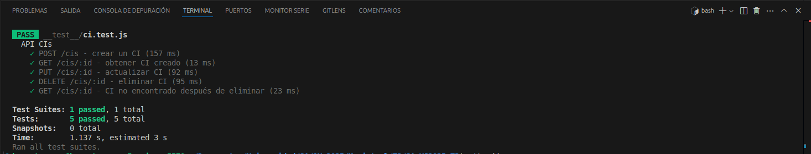

# Instrucciones para usar aplicaion

## Base de datos
Las tablas de la base de datos se crean cuanod se levanta la aplicacion y haya comunicacion con la base de datos


## Comandos a ejecutar 

### con docker compose
```bash
 docker compose up -d
```

### local

```bash
# para ejecuatar speed.js que sera para insertar datos importantes a la tabla
node speed.js

# para arrancar el sistema
npm start
```

## VARIABLES DE ENTORNO IMPORTARTES
```bash
NODE_ENV=production # necesario si se ejecuta en produccion
DB_NAME=cmdb_test
DB_USER=admin
DB_PASSWORD=admin123
DB_HOST=localhost
DB_PORT=5432
```

## Estructura de body para endpoints
Usar swagger editor online para ver la estructura de los endpoints y su manejo en la aplicacion
[Endpoints](ci-swagger.yaml)


## Bodys importantes de ejemplos
**Crear CI `(POST /cis)`**
```json
{
    "name": "ServidorApp01",
    "description": "Servidor de aplicaciones empresariales",
    "ci_type_id": 1,
    "serial_number": "SN12345",
    "version": "v1.0",
    "acquisition_date": "2022-01-01",
    "current_state": "Activo",
    "physical_location": "Sala 1",
    "owner": "Infraestructura",
    "change_date": "2022-01-10",
    "change_description": "Instalación inicial",
    "related_docs": "[Enlace a Manual](url)",
    "incident_links": "[Incidente1](url)",
    "security_level_id": 1,
    "compliance_level_id": 1,
    "config_state": "Aprobado",
    "license_number": "LIC123",
    "expiration_date": "2024-01-01",
    "environment_id": 3
}
```

**Relación CI padre-hijo `(POST /cis/:id/children)`**
``` json
{
    "child_ci_id": 2
}
```


**Actualizar CI `(PUT /cis/:id)`**
```json
{
    "description": "Servidor actualizado con nuevo parche",
    "version": "v1.1",
    "change_date": "2023-05-01",
    "change_description": "Actualización de versión"
}  
``` 


## Para realizar las pruebas unitarias
- se necesita que la base de datos este levantada
- ejecutar archivo speed.js
```bash
node speed.js
```
- ejecuatar pruebas
```bash
npm test
```

